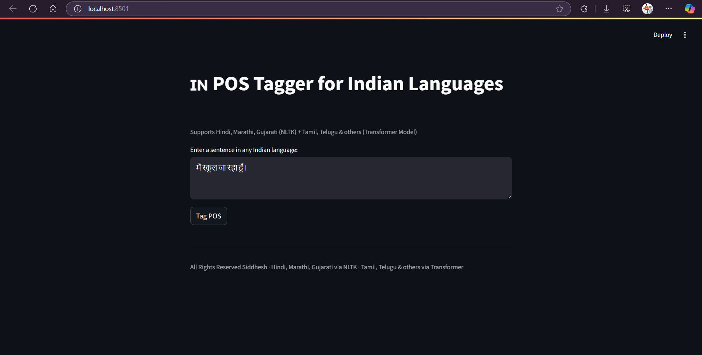

# POS-Tagging-for-Indian-Languages

This project focuses on developing Part-of-Speech (POS) taggers for major Indian languages like Hindi, Marathi, Bengali, Tamil, Telugu, Kannada, Gujarati, and Punjabi. POS tagging assigns grammatical labels (like noun, verb, adjective) to each word in a sentence. Due to the rich morphology of Indian languages, we explore rule-based, statistical (like HMM), and deep learning models (like BiLSTM) using annotated corpora to improve tagging accuracy and support NLP applications like translation and speech recognition.

